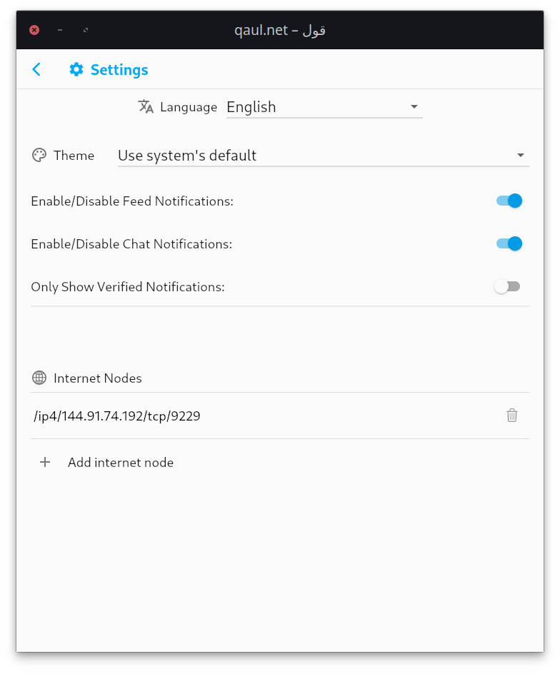

# How To run a qaul Community Node

You can run qaul in the background as a community node. For example, on a server in the internet, or locally on a Raspberry Pi.

It is as simple and easy to set up as running the qaul app.

The application name is `qauld`

## Download & Install

### For Debian based Systems (Ubuntu, Raspberry OS, etc.)

Download the latest Debian installer from the github release page:

[Download qauld]

Install it on your system by either double clicking it and following the install instructions or via the terminal:

```bash
# move with your terminal into the same folder as the installable
# file is and run the following command.
# Be aware that the .deb package file may be differently.
sudo dpkg -i qauld_2.0.0_amd64.deb
```

### For all Systems

You can download the latest binaries directly from github:

[Download qauld]

Once you start the app, it will store the configuration and the data base into the folder of the working directory from which you start the program from.

## Start Community Node for the First Time

When you start the community node for the first time you can provide a name for your node as a command line argument.

You start the node with the following command:

```bash
qauld --name="Your Node's Name"
```

By default the node is listening on port 9229.

You can optionally set the port number at first startup via the command line argument.

```bash
qauld --name="Your Node's Name" --port="9229"
```

Afterwards you can change the port number in the `config.yaml` file which is automatically generated at first startup.

## Advertising your Node

When your community node is running in your local wifi, all devices running qaul in the same wifi will find it automatically.

When your community node is running on a server on the Internet, you can connect

By default the node is listening on port 9229.

The information to access your node is therefore the IP address of your device and the port number. It is displayed in the scheme `/{IP PROTOCOL VERSION}/{IP ADDRESS}/tcp/{PORT NUMBER}`.
Below you see an example of the qaul community node. Just exchange the IP address in it with your devices address:

```txt
/ip4/144.91.74.192/tcp/9229
```

Now people running the qaul app can add it under settings > Add internet node



## Maintaining the Community Node

All data of the node is the directory from which the qauld is executed from.

Your node's configuration is written in the file `config.yaml`. If you want to change the name of your node, you can simply edit this file and change the following line:

```yaml
user_accounts:
- name: Your Node's Name
```

Your sever is fixed on the port 9229, you can change it to any other port you want.
To change the port under which the node is running change the port number of the multiaddress in the `config.yaml` file.

```yaml
  listen: /ip4/0.0.0.0/tcp/9229
```

To run the node after the first time, you can simply execute:

```bash
qauld
```

[Download qauld]: https://github.com/qaul/qaul.net/releases