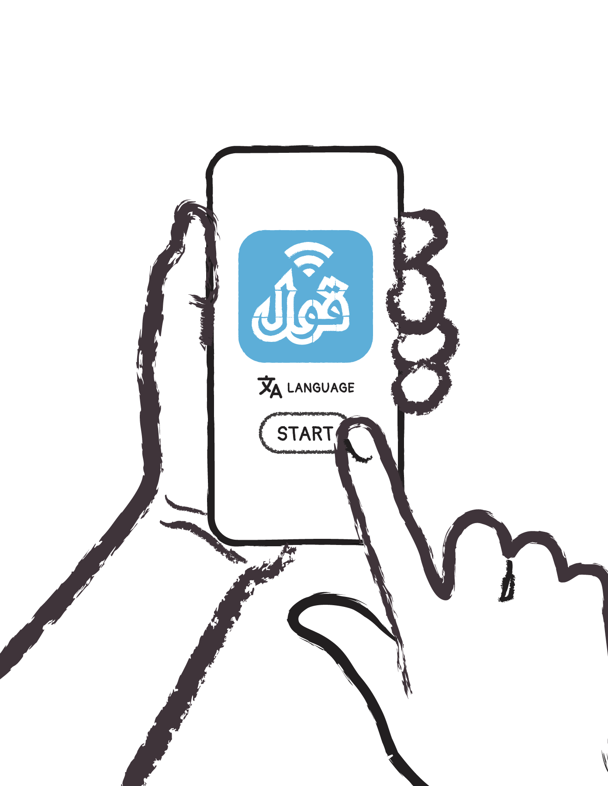
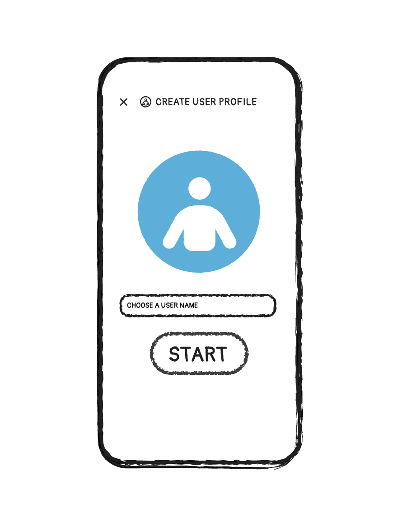
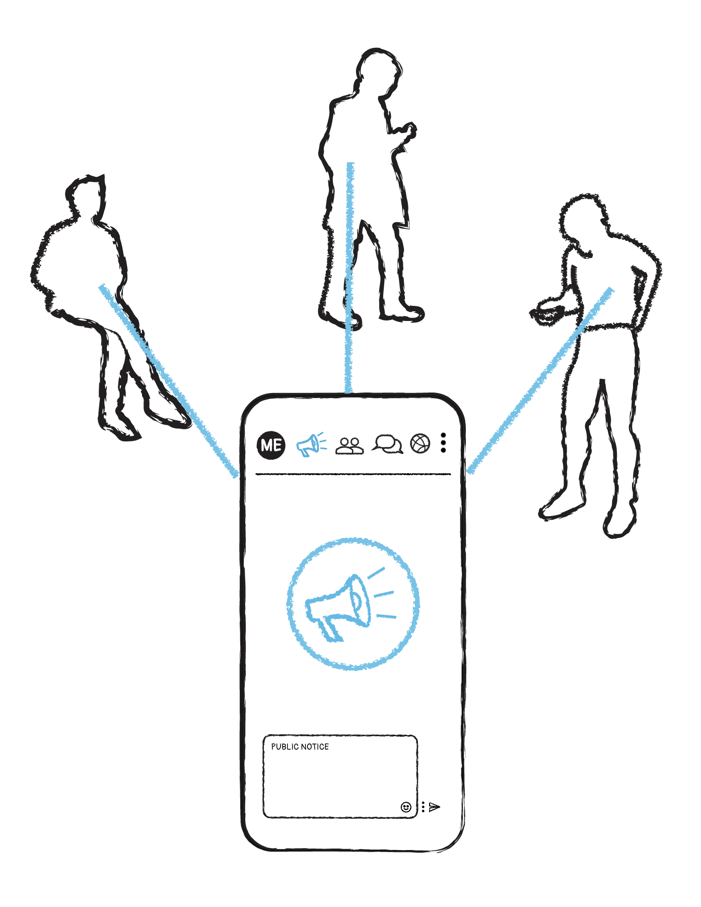
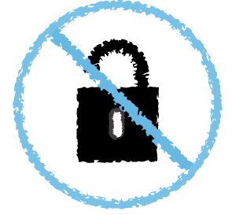
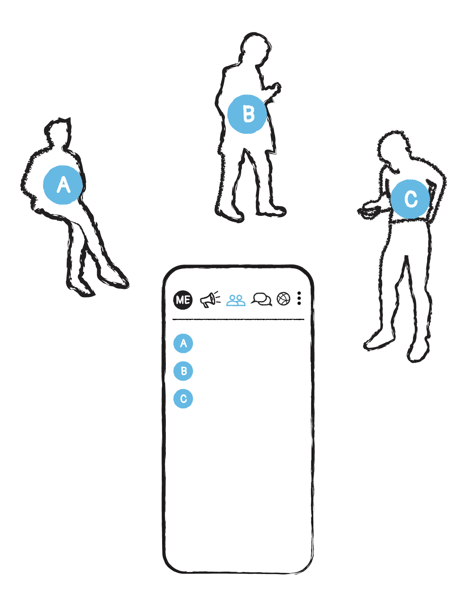
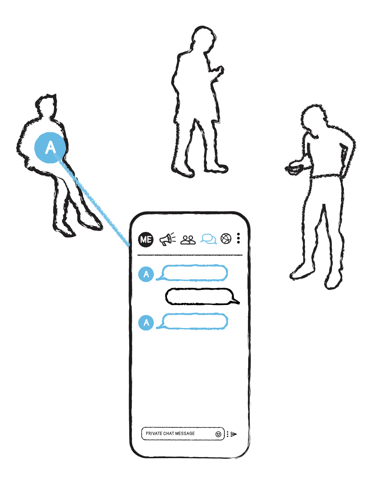
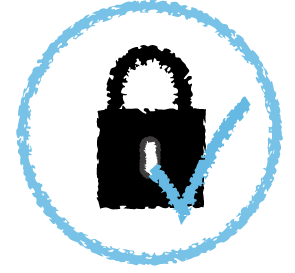
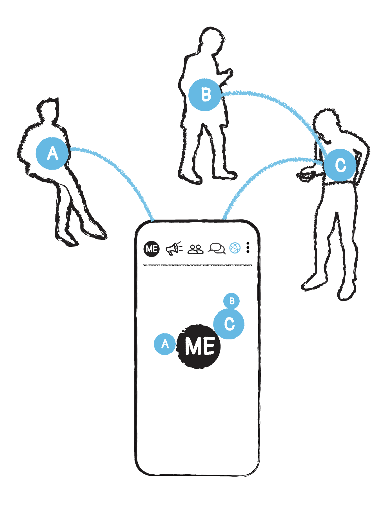

Install qaul software, select the language and start

For your user profile you only need to choose a user name. You are free to select any name with at least two characters, numbers or emoticons.

Choose the name wisely:

- You can stay anonymous, but probably you would like to be recognised by your friends.
- Your profile is defined with this user name, you can’t change the name without creating a new profile.

|                      |                                                                                  |
|----------------------|:--------------------------------------------------------------------------------:|
|  | The screen you see now with the first tab is for public announcement. You can post messages, visible for everyone in the network. |
|  | Keep in mind: public messages go to everyone in the network. These messages are verified regarding to the sender, but as public announcements they are not confident or secured. |

|                      |                                                                                  |
|----------------------|:--------------------------------------------------------------------------------:|
|  | This is the user section. Here you find all the users in the network and also the groups, you are invited to or you joined already. |
|  | You can verify other users and secure the communication actively. By verifying the identity of other users you make sure that they are exactly who they’re claiming to be. |

|                      |                                                                                  |
|----------------------|:--------------------------------------------------------------------------------:|
|  | Chat messages are encrypted and only to read for your chat partner. |
|  | All your chat conversations and group chats are always end-to-end encrypted. |

|                      |                                                                                  |
|----------------------|:--------------------------------------------------------------------------------:|
|  | qaul allows you to see the Internet Independent Wireless Mesh Network. You see how you are connected with other users. |
