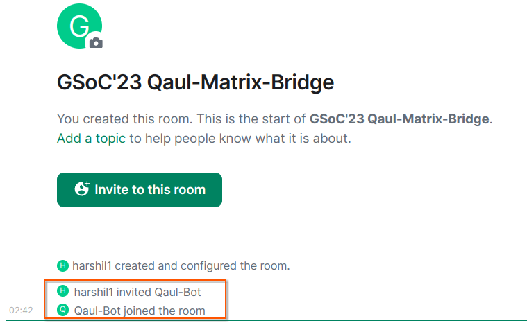
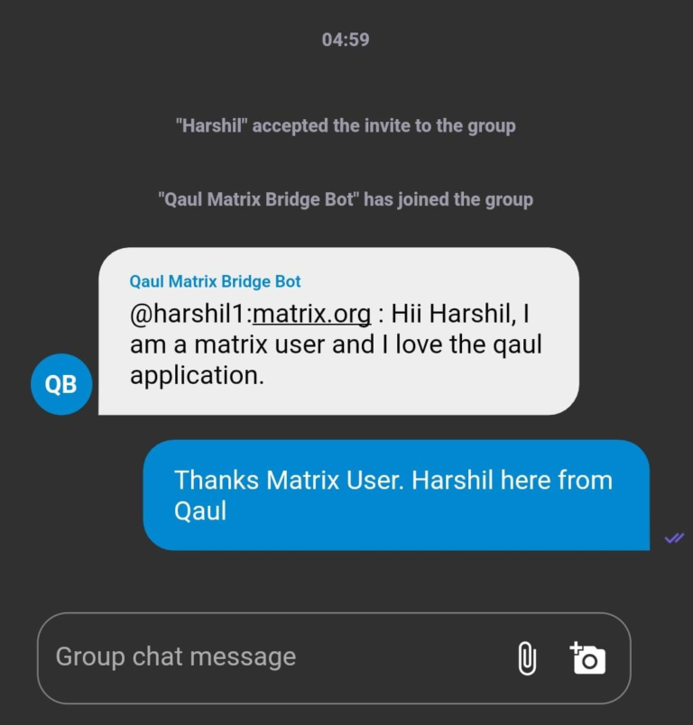

# Bridge tutorial

### Requirements
You should have an account on matrix that can act as a bridge bot.

For more secure communications you can opt for running your own matrix homeserver but that is not necessary since our bridge works well on the default matrix server as well.

You should have the binary to the bridge either as code or distributed package.

We are still working on packaging the binary for end users and then in place of 
`cargo run –p qaul-matrix-bridge` you can simply run our binary.

### Initialization and Configuration
As of now, We are supporting the bridge only as a daemon process binary without any control on it via CLI or GUI. All the logics are integrated on matrix-sdk or ruma and qaul or libqaul.

On the server where you wish to start a binary between a local qaul network, You need to have one node running the binary and rest will follow along the way.

After installing the qaul project you can

```
cargo run -p qaul-matrix-bridge -h {homeserver_url} -a {bot-account} -p {bot-account-password} -f {feed_room_matrix_id}
```

- homeserver [-h or --homeserver] : The URL for matrix homeserver. Default can be [https://matrix.org]
- bot-account [-a or --account] : The user account of the bot on matrix. Eg : @qaul-bot:matrix.org then id is [qaul-bot]
- bot-account-password [-p or --password] : The password for your bot account on matrix
- feed_matrix_room [-f or --feed] : This option helps you to configure any one room as matrix


### Inviting the Bridge to Matrix Room

Once the bridge is running up. You have to go to your own matrix account and create a new room. Please make sure to turn off any encryption. Now invite the bot to your matrix room and it automatically joins the room.

1. Create a matrix room and disable end to end encryption


2. Invite the bot account into the room 

  

# Navigating through Matrix Menu
We have multiple menu options available in our Matrix Menu. You can see the list of all the possible functionalities with !help command.
### !help 


### !qaul 


### !users 


### !invite 




### !group-info


### !remove


# File Exchanges


