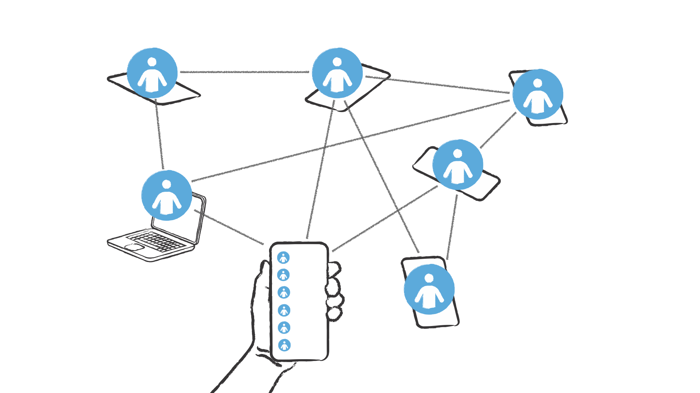
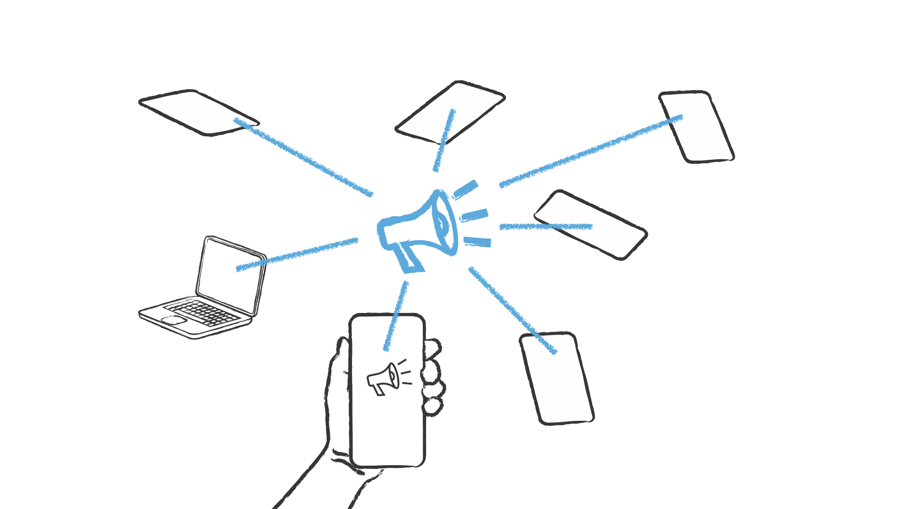
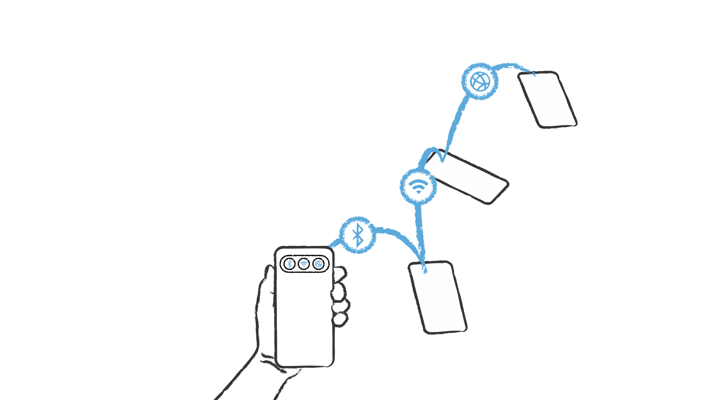
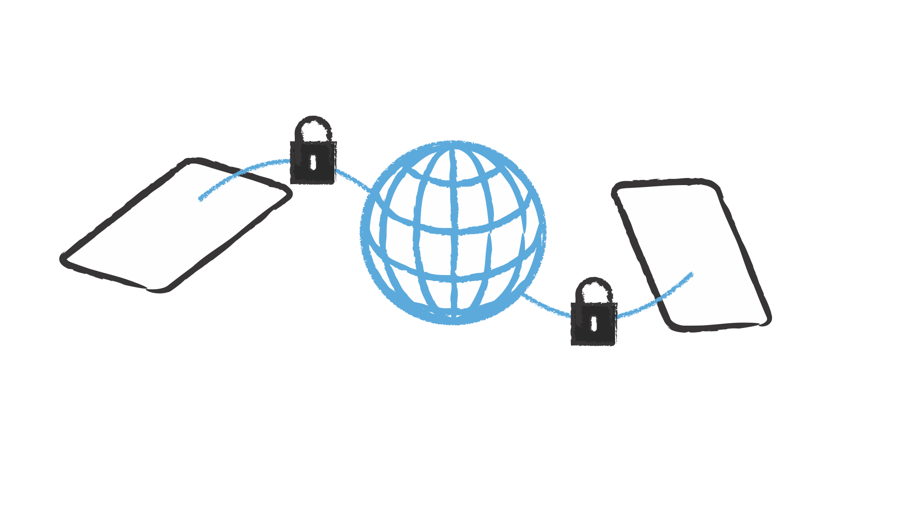
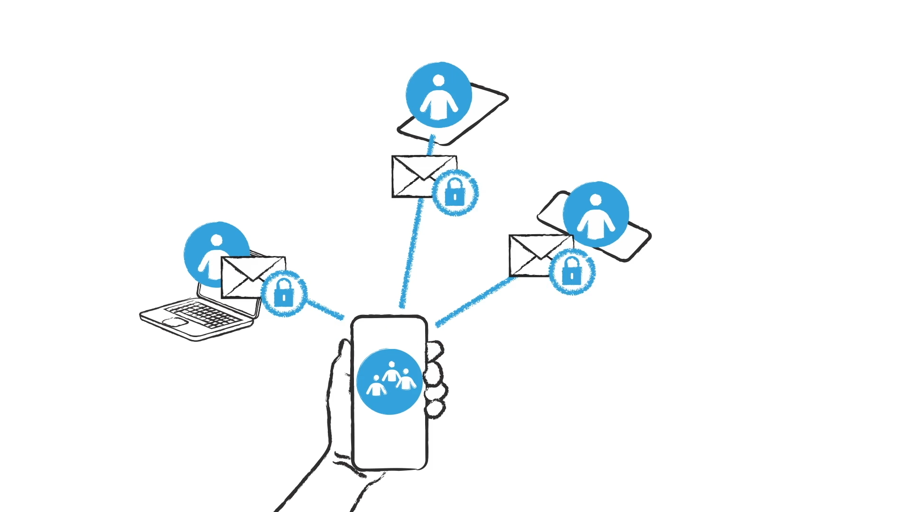

# qaul App User Documentation

qaul is a free, open-source communication app, which allows you to communicate with the people around you, without any Internet or communication infrastructure.

## Download & Install qaul.net

App stores: Google Play, iOS Store, Apple App Store, Linux snap store

You can find all the latest links and downloads on this web site <https://qaul.net/download>

## Start qaul.net

You can choose any user name you want, it can contain letters from any system, spaces, emoticons etc.

## Communicate with Everyone Around you

All other reachable qaul.net users around you are automatically displayed in the app.

You can write public messages, that are spread in the entire network, to inform users about things happening.

You can chat with users directly, create chat group and send private and fully encrypted messages.

## All Devices are Interlinked

No matter how you are connected, via Wifi, Bluetooth, or even via the Internet. All devices are interlinked and can send messages to users currently connected.

When a user is not connected, other devices can store the encrypted messages and deliver it as soon as this user gets online.

## Security & Privacy

qaul.net protects your privacy. All data is stored locally on your device, your qaul identity does not contain any personal information.

All connections between devices are encrypted. Outsiders who are not part of the network, cannot decrypt the traffic.

Your qaul ID number stays with you until you delete the app. It is directly linked to your cryptographic key. Every message you write is cryptographically signed, for that nobody can write a message in your name or fake your identity.

All chat messages are end to end encrypted, which ensures that only you and the person you write the message to can read the messages.
